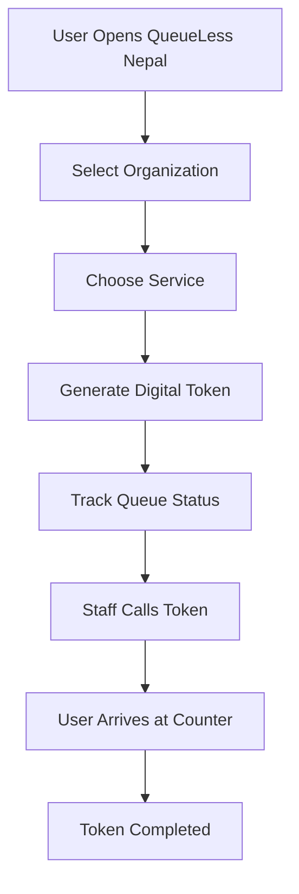
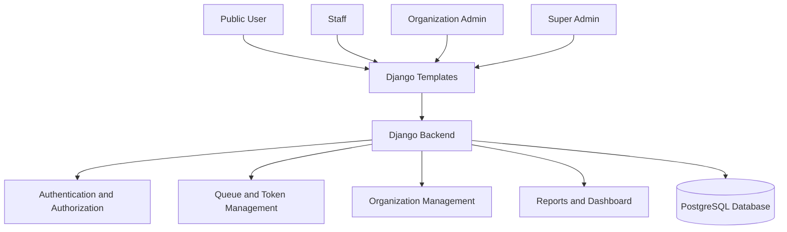

# QueueLess Nepal 🚀

<p align="center">
  
  
  
  
</p>

<p align="center">
  <b>A SaaS-Based Digital Queue and Token Management System for Service-Based Organizations</b>
</p>

<p align="center">
  QueueLess Nepal helps users generate digital tokens, track live queue status, and reduce unnecessary physical waiting in service-based organizations.
</p>

---

## 📌 Project Overview

**QueueLess Nepal** is a Django-based digital queue and token management system designed for hospitals, banks, government offices, colleges, clinics, consultancies, and other service-based organizations.

In many organizations, users still need to stand in long physical queues without knowing their position, estimated waiting time, or when their turn will arrive. This creates crowding, confusion, wasted time, and poor service experience.

QueueLess Nepal solves this problem by allowing users to take a digital token, view live queue status, and arrive when their turn is near. The platform also provides role-based dashboards for staff, organization admins, and super admins to manage queue operations efficiently.

---

## 🏆 Hackathon Achievement

QueueLess Nepal was developed as a hackathon project idea by **Team Q-Killers** and secured **2nd Runner-Up** at **SparkEEC 1.0 Hackathon**.

The project was built with the goal of solving a real-world public service problem by reducing physical queues and making service delivery more transparent, organized, and user-friendly.

---

## 🎯 Problem Statement

Many service-based organizations face problems such as:

- Long and unmanaged physical queues
- Lack of real-time queue visibility
- Users not knowing how many people are ahead
- Missed turns due to unclear queue announcements
- Crowding near counters and service areas
- Difficulty for staff to manage tokens manually
- Poor user experience in hospitals, banks, and public offices

QueueLess Nepal provides a simple digital solution to make queue management more efficient and transparent.

---

## ✅ Proposed Solution

QueueLess Nepal provides a digital token system where users can select an organization, choose a service, generate a token, and track their queue status online.

Staff members can call, skip, recall, and complete tokens from their dashboard. Organization admins can manage services, counters, queues, and staff. Super admins can monitor and manage the overall platform.

In simple words:

```text
User takes token → Staff calls token → Queue status updates → User reaches counter
```

---

## ✨ Key Features

### 👤 Public User

- View available organizations
- Browse available services
- Generate digital token
- Track live token status
- View current serving token
- Check estimated waiting information
- Use English ⇄ नेपाली language support
- Access mobile-friendly pages

### 🧑‍💼 Staff

- View assigned queue
- Call next token
- Skip absent token
- Recall skipped token
- Complete token
- Create token for non-mobile users
- View daily queue reports

### 🏢 Organization Admin

- Manage organization profile
- Add and manage services
- Manage counters
- Assign staff
- Open and monitor queues
- View queue reports
- Track organization-level activity

### 🛡️ Super Admin

- Manage platform users
- Approve or reject organizations
- Monitor platform activities
- View system-level dashboard
- Manage organizations and subscriptions

---

## 🔄 Basic System Workflow



---

## 🏗️ System Architecture



---

## 🧩 Main Modules

| Module | Description |
|---|---|
| Authentication Module | Handles login, logout, registration, and role-based access |
| Organization Module | Manages organization profile, services, counters, and staff |
| Queue Module | Handles queue creation and queue monitoring |
| Token Module | Generates and tracks user tokens |
| Staff Module | Allows staff to call, skip, recall, and complete tokens |
| Report Module | Provides daily queue performance summaries |
| Super Admin Module | Manages platform-level users and organizations |
| Language Support | Provides English ⇄ नेपाली interface support |

---

## 🛠️ Tech Stack

| Layer | Technology |
|---|---|
| Backend | Django |
| Database | PostgreSQL |
| Frontend | HTML, CSS, JavaScript |
| Template Engine | Django Templates |
| Static File Handling | WhiteNoise |
| Deployment | Render |
| Version Control | Git and GitHub |

---

## 📁 Project Structure

```text
QueueLess-Nepal/
│
├── manage.py
├── requirements.txt
├── build.sh
├── README.md
├── .gitignore
├── .env.example
│
├── queueless_nepal/
│   ├── settings.py
│   ├── urls.py
│   ├── wsgi.py
│   └── asgi.py
│
├── accounts/
├── core/
├── organizations/
├── customers/
├── staff/
├── dashboard/
├── queue_management/
│
├── templates/
│   ├── base.html
│   ├── home.html
│   ├── staff/
│   ├── org_admin/
│   └── customer/
│
├── static/
│   ├── css/
│   ├── js/
│   └── images/
│
└── media/
```

---

## ⚙️ Local Setup Guide

### 1. Clone the Repository

```bash
git clone https://github.com/your-username/queueless-nepal.git
cd queueless-nepal
```

### 2. Create Virtual Environment

```bash
python -m venv .venv
```

### 3. Activate Virtual Environment

For Windows PowerShell:

```bash
.\.venv\Scripts\Activate.ps1
```

For Linux/macOS:

```bash
source .venv/bin/activate
```

### 4. Install Dependencies

```bash
pip install -r requirements.txt
```

### 5. Create `.env` File

Create a `.env` file in the root directory and add:

```env
SECRET_KEY=your_secret_key_here
DEBUG=True
ALLOWED_HOSTS=127.0.0.1,localhost
CSRF_TRUSTED_ORIGINS=http://127.0.0.1,http://localhost

DB_NAME=your_local_database_name
DB_USER=postgres
DB_PASSWORD=your_database_password
DB_HOST=localhost
DB_PORT=5432
```

### 6. Run Migrations

```bash
python manage.py makemigrations
python manage.py migrate
```

### 7. Create Superuser

```bash
python manage.py createsuperuser
```

### 8. Run Development Server

```bash
python manage.py runserver
```

Open in browser:

```text
http://127.0.0.1:8000/
```

---

## 🚀 Deployment on Render

### Required Environment Variables

```env
SECRET_KEY=your_render_secret_key
DEBUG=False
ALLOWED_HOSTS=your-app-name.onrender.com
CSRF_TRUSTED_ORIGINS=https://your-app-name.onrender.com
DATABASE_URL=your_render_postgresql_internal_database_url
```

### Build Command

```bash
bash build.sh
```

### Start Command

```bash
gunicorn queueless_nepal.wsgi:application
```

### `build.sh`

```bash
#!/usr/bin/env bash
set -o errexit
set -o pipefail

pip install -r requirements.txt
python manage.py collectstatic --noinput
python manage.py migrate --noinput
```

---

## 🌐 Language Support

QueueLess Nepal supports:

```text
English ⇄ नेपाली
```

The language switcher helps Nepali users understand and use the platform more easily.

---

## 🔐 Security Notes

- Do not push `.env` to GitHub.
- Keep `SECRET_KEY` private.
- Keep `DATABASE_URL` private.
- Use `DEBUG=False` in production.
- Add Render domain in `ALLOWED_HOSTS`.
- Add Render HTTPS URL in `CSRF_TRUSTED_ORIGINS`.

---

## 🧪 Testing Checklist

Before deployment, run:

```bash
python manage.py check
python manage.py makemigrations --check
python manage.py collectstatic --noinput
python manage.py runserver
```

After deployment, test:

```text
/
 /admin/
 /accounts/login/
 /staff/
 /org-admin/
 /customer/
```

---

## 📈 Future Enhancements

- Progressive Web App support
- Real-time queue updates using WebSocket or SSE
- SMS notification support
- Advanced analytics dashboard
- Multi-branch organization support
- Offline token status view
- Better Nepali localization

---

## 📄 License

This project was developed for academic and hackathon purposes.

---

## 🙌 Acknowledgement

Special thanks to the SparkEEC 1.0 Hackathon organizers, mentors, judges, and Everest Engineering College for providing a valuable platform to build and present this idea.

---

<p align="center">
  <b>QueueLess Nepal — Less Waiting, Smarter Service.</b>
</p>